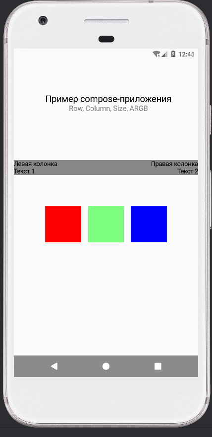

# Лабораторная работа №5. Jetpack Compose: контейнеры, ARGB-модель и Material Design
## Цель работы
Повторить основы разработки пользовательского интерфейса на Jetpack Compose, работу с контейнерами Row и Column, познакомиться с ARGBмоделью цветов, компонентом Scaffold и принципами Material Design.
## Краткое описание приложения
В ходе лабораторной работы было создано приложение на Android с использованием фреймворка **Jetpack Compose**. В приложении реализованы:
### 1. Работа с контейнерами
- Использование **`Row`** для горизонтального расположения элементов
- Использование **`Column`** для вертикального расположения элементов
- Управление выравниванием и расположением с помощью модификаторов и **`Arrangement`**
### 2. Посимвольный вывод строки
- Фильтрация строки для удаления небуквенных символов
- Отображение каждого символа отдельным элементом **`Text`** внутри **`Row`** с заданными отступами
### 3. Работа с цветами в ARGB-формате
- Создание цветных блоков с использованием **`Box`**
- Применение прозрачных и непрозрачных цветов через **ARGB-коды**
### 4. Использование Scaffold
- Создание стандартного экрана с верхней панелью (**`TopAppBar`**)
- Добавление плавающей кнопки действия (**`FloatingActionButton`**)
- Структурирование контента в соответствии с принципами **Material Design**
### 5. Комбинирование контейнеров
- Создание сложных макетов с вложенными **`Row`** и **`Column`**
- Использование **`Spacer`** для создания отступов между элементами
## Скриншот результата выполнения дз

## Автор
Зламанюк А.А., Телятникова Е.П.
## Лицензия
Проект создан в учебных целях.
